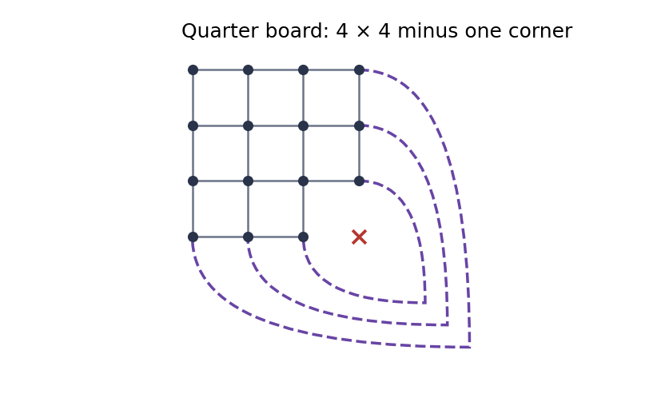
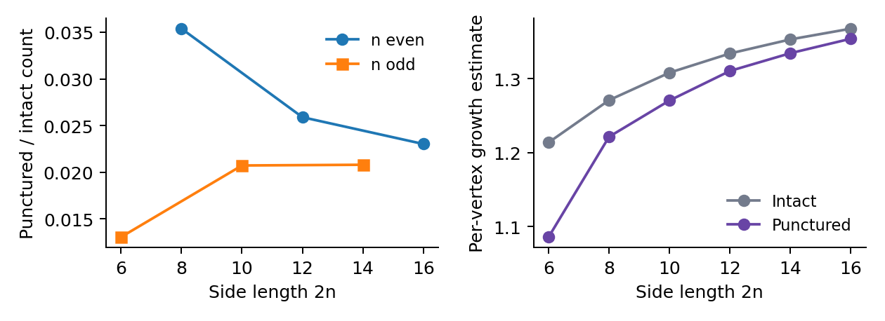

Hamiltonian cycles on square grids
with a central 2 × 2 hole

Jason Roell  •  Research-note draft  •  26 September 2026

## Abstract

I enumerate undirected Hamiltonian cycles on the 2n × 2n lattice grid after deleting its four central vertices, for 1 ≤ n ≤ 8. Two frontier implementations give identical exact counts. Half-board and quarter-board reductions also count cycles fixed by square symmetries, giving geometric orbit counts and exact stabilizer classes. A separate edge-orbit search verifies the symmetry counts through the 8 × 8 case. The note includes state counts, resource measurements, and reproducible source code. Its finite-size comparisons are descriptive; they do not establish a limiting growth constant or a new critical exponent.

## 1. Definition and exact sequence

Let Gₙ have vertices (x, y) with 1 ≤ x, y ≤ 2n, except for (n, n), (n, n+1), (n+1, n), and (n+1, n+1). Edges join lattice neighbors. For n ≥ 2 it has 4n² − 4 vertices and 8n² − 4n − 12 edges. Let Hₙ count connected spanning subgraphs in which every vertex has degree two. Cycles are edge sets: no starting vertex or direction is distinguished. Rotated and reflected edge sets are initially distinct. Set H₁ = 0 because G₁ is empty.

| n | Grid | Hₙ |
| --- | --- | --- |
| 1 | 2 × 2 | 0 |
| 2 | 4 × 4 | 1 |
| 3 | 6 × 6 | 14 |
| 4 | 8 × 8 | 164102 |
| 5 | 10 × 10 | 9684216390 |
| 6 | 12 × 12 | 27867828294632440 |
| 7 | 14 × 14 | 1167509412814480584454378 |
| 8 | 16 × 16 | 1517021583328338160591145724550850 |

The 4 × 4 punctured graph is a single 12-cycle. At the largest size the raw count is 1,517,021,583,328,338,160,591,145,724,550,850, while the count modulo all eight symmetries of the square is 189,627,697,916,042,276,889,063,633,686,282.

The enumeration method is an adaptation of established connectivity transfer methods, not a claim of a new general algorithm. Related work and the present verification boundary are discussed in Section 8.

<!-- page -->

# 2. Frontier recurrence and correctness

Process lattice positions in row-major order. A frontier separates processed positions from unprocessed positions and has at most w+1 slots for a board of width w. A slot is empty or carries a selected edge to the unprocessed side. Every processed vertex has its required degree, and every connected component built so far is a path. The state records which occupied slots are the two ends of each such path.

In the primary implementation, planarity makes the endpoint pairing noncrossing. Encode empty slots by 0 and the two ends of each pair by opening and closing parentheses, represented by 1 and 2. A word of w+1 slots uses 2(w+1) bits. The checker stores each partner index explicitly; it does not use parenthesis matching. Both implementations aggregate equal frontier states in hash maps.

Empty slots and noncrossing endpoint pairs form Motzkin words. Consequently, w+1 slots admit at most M(w+1) possible words, where M is the Motzkin sequence. At width 16 this bound is M(17) = 2,356,779. Only reachable states are created. A local update has at most two choices; matching a parenthesis can scan O(w) slots.

## Local transitions

| Incoming selected edges | Required action |
| --- | --- |
| 0 | Choose both outgoing edges, right and down, if both neighbors exist. Create a new paired path. |
| 1 | Choose exactly one available outgoing edge and move the incoming path endpoint to it. |
| 2, different paths | Choose no outgoing edge. Join the two paths and pair their other endpoints. |
| 2, same path | Accept only at the last remaining vertex, with no other occupied frontier slots. |
| Deleted position | Permit no selected incident edges. Pass the state through only when both local slots are empty. |

If Dₜ(s) is the number of partial edge sets producing state s after t positions, then Dₜ₊₁(s′) is the sum of Dₜ(s) over legal local choices leading from s to s′. Initialize the empty state with weight one. At each row boundary, shift the contour slots; at the final vertex, accumulate only the legal single-cycle closure.

## Correctness argument

Induct on the processing order. Every legal transition preserves degree two at a newly processed vertex and preserves the path interpretation of the frontier. Joining two ends of the same path is the only way to create a closed component; rejecting that transition before the final closure excludes every disconnected 2-factor. Conversely, restricting any Hamiltonian cycle to successive processed regions produces exactly these legal states and choices. Each lattice edge is decided once, at its earlier endpoint, so an accepted edge set has exactly one construction history. No division by the cycle length or by two is required.

Counters are checked unsigned 256-bit integers, implemented as four 64-bit limbs. Addition aborts on overflow instead of wrapping. No overflow occurred in any recorded run. The implementations accept dimensions up to 16, so their state encodings remain within the supported bit widths.

<!-- page -->

# 3. The hole, pruning, and measured state space

A removed vertex contributes only an empty local transition. Edges pointing into the hole are disabled before they can be selected. The geometric scan still crosses the entire rectangular board. Empty slots at the hole do not split the state into independent left and right problems: paths on opposite sides can already be connected through the processed region, and their endpoint pairing must be retained globally.

The hole creates an inner face, but it does not invalidate noncrossing pairings on the outer scan contour. Disjoint planar paths with endpoints on that contour cannot realize an interlacing pairing. No extra winding label is needed for the raw count; the state already retains exactly the connectivity that can affect a continuation.

Figure 1. Deleted vertices (crosses) and the row-end state profile for side 16. Shading marks the rows containing deleted vertices. The reduction starts one row earlier because edges into the hole are disabled. The chart is sampled at row ends; the peak over every vertex transition is larger.

| Grid | Peak states | Time (s) | Peak RSS (MiB) |
| --- | --- | --- | --- |
| 4 × 4 | 1 | 0.000010 | 1.719 |
| 6 × 6 | 40 | 0.000040 | 1.750 |
| 8 × 8 | 339 | 0.000233 | 1.891 |
| 10 × 10 | 2,120 | 0.002916 | 2.578 |
| 12 × 12 | 13,943 | 0.035642 | 5.422 |
| 14 × 14 | 95,660 | 0.476549 | 24.375 |
| 16 × 16 | 677,909 | 11.006828 | 315.797 |

For the 16 × 16 punctured board, the peak of 677,909 distinct active states first occurs after row 13, column 13. At row ends, the maximum is 349,998 states. The two hash maps coexist during a transition; the reported process RSS includes both maps, buckets, and allocator overhead.

Pruning consists of degree constraints, missing-neighbor constraints, and rejection of premature cycles. The raw counter does not identify reflection-related or rotation-related states, and it does not perform future-reachability pruning. Measurements are single runs on an Apple M4 Max with 128 GiB RAM, using Apple clang 21.0.0 and -O3 -std=c++17. They are not repeated or isolated performance benchmarks.

<!-- page -->

# 4. Counting fixed cycles on smaller boards

Write R₂ for the number of full-board cycles fixed by 180° rotation, R₄ for the number fixed by 90° rotation, F for those fixed by one specified horizontal or vertical reflection, and B for those fixed by both of those reflections. The symmetry counter uses explicit endpoint partners and allows temporary boundary stubs. It never closes a path inside the smaller board.

## Half board: F and R₂

Take rows 1 through n, with the two central vertices removed from the last row. A reflection-fixed spanning cycle must cross the reflection axis. Each crossing edge is fixed setwise, and a nonidentity reflection of a cycle can fix only two edges when it fixes no vertices. Thus there are exactly two crossings. The retained half is a single Hamiltonian path whose two endpoints lie at allowed positions on the cut. Counting final states with exactly two paired stubs gives F.

For a half-turn, identify every omitted vertex with its rotated representative. On the cut, pair column x with column 2n+1−x. Selected seam edges complete the half-board paths into a quotient cycle. Require one quotient component and an odd number of seam edges. Each seam changes the copy index by one modulo two; odd parity makes the lift one full-board cycle rather than two cycles. This gives R₂ without enumerating full-board cycles.

## Quarter board: R₄ and B

For a quarter-turn, use the n × n quadrant with corner (n, n) deleted. Add seam edges joining (n, k) to (k, n), for 1 ≤ k < n. A connected quotient cycle lifts to a connected cycle on four copies precisely when its net change of copy index is coprime to four. Each seam contributes +1 or −1, so this condition is equivalent to an odd number of seam edges. Final states are tested for this parity and for a single quotient component.

Figure 2. Quarter-board quotient for the 8 × 8 case. Dashed curves are the additional seam edges, not original grid edges. The deleted corner removes the central obstruction.

If a full cycle is fixed by both axial reflections, it crosses each axis exactly twice. Cutting at those four edges leaves one spanning path in each quadrant. Its endpoints lie respectively on the two inner sides. Counting quarter-board states with exactly two paired stubs, one on each inner side, gives B. Reflection reconstructs the full cycle uniquely.

<!-- page -->

# 5. Burnside count and parity restrictions

For n ≥ 3, a diagonal reflection fixes 2n−2 remaining vertices of Gₙ. Its restriction to a Hamiltonian cycle would be a nonidentity cycle automorphism fixing at least four vertices, which is impossible. Thus neither diagonal reflection fixes a cycle. The n=2 graph is the single 12-cycle and is fixed by every square symmetry.

A quarter-turn exchanges the two checkerboard colors of an even-sided grid. On a Hamiltonian cycle of length 4n²−4, an order-four rotation acts by a shift of n²−1 or 3(n²−1) vertices. When n is odd these shifts are even, so they preserve checkerboard color. This contradiction proves R₄ = 0 for odd n. The deleted central block reverses the familiar parity obstruction for intact square grids [2].

Let Oₙ count edge sets modulo the dihedral group D₄. Burnside's lemma gives, for n ≥ 3:

Oₙ = (Hₙ + R₂ + 2R₄ + 2F) / 8.

The identity contributes Hₙ; the half-turn contributes R₂; the two quarter-turns have the same fixed set; and the two axial reflections are conjugate. For n=2, add the two diagonal-reflection contributions of one before dividing by eight.

| n | R₂: 180° rotation | F: one axial reflection |
| --- | --- | --- |
| 2 | 1 | 1 |
| 3 | 2 | 4 |
| 4 | 398 | 436 |
| 5 | 39598 | 58198 |
| 6 | 155368312 | 96650662 |
| 7 | 480564699890 | 308860488706 |
| 8 | 34116385160498522 | 10202488985967222 |

| n | R₄: 90° rotation | B: both axes | Oₙ: geometric orbits |
| --- | --- | --- | --- |
| 2 | 1 | 1 | 1 |
| 3 | 0 | 2 | 3 |
| 4 | 18 | 20 | 20676 |
| 5 | 0 | 138 | 1210546548 |
| 6 | 8650 | 6406 | 3483478580414922 |
| 7 | 0 | 201338 | 145938676601947358766460 |
| 8 | 106253220 | 41184930 | 189627697916042276889063633686282 |

In particular, O₈ = 189,627,697,916,042,276,889,063,633,686,282. These are geometric equivalence classes under the symmetries of the embedded square, not classes under arbitrary abstract graph isomorphism.

For every size, the Burnside numerator is divisible by eight. That is a consistency check, not an independent proof of the fixed-cycle counts. The separate edge-orbit enumeration in Section 8 supplies a different check.

<!-- page -->

# 6. Exact stabilizer classes

Burnside gives the total number of orbits. The same fixed-set counts determine how many orbits have each exact symmetry group. For n ≥ 3, diagonal reflections are absent. A cycle cannot simultaneously have quarter-turn and axial-reflection symmetry, since those symmetries would generate a diagonal reflection. The remaining possibilities are the five rows below.

| Exact stabilizer | Orbit size | Number of orbits |
| --- | --- | --- |
| Identity only | 8 | (Hₙ − R₂ − 2F + 2B) / 8 |
| One axial reflection | 4 | (F − B) / 2 |
| 180° rotation only | 4 | (R₂ − R₄ − B) / 4 |
| Both axial reflections and 180° | 2 | B / 2 |
| 90° rotations, no reflection | 2 | R₄ / 2 |

To derive the formulas, first observe that B and R₄ count disjoint sets of edge sets with order-four stabilizers. Each such orbit has two members. After subtracting them from R₂, the remaining half-turn-fixed edge sets come in orbits of size four. Each one-reflection orbit contributes two members fixed by the specified axis, which explains the factor two in (F−B)/2. Subtracting all nontrivial stabilizers from Hₙ gives the first row.

## The 16 × 16 punctured board

| Exact symmetry | Number of geometric orbits |
| --- | --- |
| Identity only | 189627697916042263258722834310968 |
| One axial reflection | 5101244472391146 |
| 180° rotation only | 8529096253265093 |
| Both axes and 180° rotation | 20592465 |
| 90° rotations, no reflection | 53126610 |
| All square symmetries | 0 |
| Total | 189627697916042276889063633686282 |

The class counts are all nonnegative integers. Their sum equals O₈. Weighting them by orbit sizes 8, 4, 4, 2, and 2 recovers H₈ exactly. The same checks pass for every computed size. For n=2, there is instead one orbit with full D₄ stabilizer and orbit size one.

This class decomposition follows the same group-action bookkeeping used for intact grids by Wynn [2]. The half-board and quarter-board domains differ here because the central vertices are absent. The explicit quotient connectivity and seam-parity tests prevent counting a symmetric union of several cycles as one Hamiltonian cycle.

<!-- page -->

# 7. Finite-size comparison with intact grids

Let Cₙ count undirected Hamiltonian cycles on the intact 2n × 2n grid, as in OEIS A003763 [1]. Both implementations reproduce all eight available comparison values used here. Define the same-footprint ratio Qₙ = Hₙ/Cₙ. This ratio is not a probability of surviving vertex deletion: deleting vertices from an intact Hamiltonian cycle generally does not leave a Hamiltonian cycle.

For a comparison normalized by the number of visited vertices, define cₙ = Cₙ^(1/(4n²)) and hₙ = Hₙ^(1/(4n²−4)). These are finite-size exponential-growth estimators, not measurements of a limiting connective constant. Both the change in vertex count and boundary corrections must be accounted for before interpreting their difference.

| n | Qₙ = Hₙ / Cₙ | cₙ: intact | hₙ: punctured |
| --- | --- | --- | --- |
| 3 | 0.013059701 | 1.213869718 | 1.085966682 |
| 4 | 0.035377668 | 1.271048904 | 1.221570580 |
| 5 | 0.020725521 | 1.308264601 | 1.270637022 |
| 6 | 0.025894009 | 1.334201899 | 1.310584485 |
| 7 | 0.020801394 | 1.353235262 | 1.334597523 |
| 8 | 0.023026163 | 1.367762905 | 1.354161936 |

Figure 3. Exact-count ratios and per-vertex growth estimators. The lines only connect measured values. No extrapolation or fitted asymptotic curve is shown.

The ratios for n=3 through 8 are nonmonotone and show a separation between the even-n and odd-n subsequences. At n=8 the punctured count is about 2.3026% of the intact count for the same outer board. These observations support reporting parity-separated data, but seven nonempty sizes do not identify an asymptotic exponent or distinguish a constant prefactor from a slowly changing correction.

A possible future scaling model separates area, boundary, and logarithmic terms, for example log Cₙ = a(4n²) + b(2n) + c log(2n) + d + lower-order terms. An analogous model for Hₙ would use 4n²−4 visited vertices and could include parity-dependent corrections. This is a model to test, not a theorem asserted here. In particular, this note neither proves that the bulk coefficient a is unchanged by the hole nor estimates a change in it.

<!-- page -->

# 8. Reproducibility, related work, and limits

## Verification and build

The package contains a parenthesis frontier counter, a direct-partner frontier counter, a symmetry counter, and a Python checker that branches on complete edge orbits. Full path enumeration checks the 4 × 4 and 6 × 6 punctured boards, including all eight symmetry actions. Edge-orbit constraint search independently checks R₂, R₄, F, and B through side 8. The two full counters agree for intact and punctured boards at every even side from 2 through 16.

From the repository root, run:

make all
make benchmark
make test
uv sync --group paper
uv run --group paper python scripts/build_paper.py

The first three commands need a C++17 compiler with unsigned __int128 support and Python 3.11 or later. The paper uses pinned dependencies in uv.lock. Each full-board benchmark has a 300-second limit; the symmetry counter stops after 240 seconds or three million active states; each small edge-orbit check has a 60-second limit. All commands run a finite list of cases. Machine-readable counts are decimal strings, so JSON readers cannot silently round them as floating-point values.

results/benchmark.json records timing, peak state count, peak location, and process RSS for both implementations. results/symmetry.json records fixed sets and stabilizer classes. results/verification.json records the separate small-case checks. The committed tables and source checksums support exact-count reproduction; timings and memory use may differ by platform.

## Prior work and novelty boundary

Connectivity transfer methods and symmetry reduction for Hamiltonian grids are established. Wynn [2] counts symmetry classes for intact square grids and uses quadrant quotients for quarter-turn symmetry. Jacobsen [3] enumerates circuits, walks, and chains by transfer methods. Blanco and Zeilberger [4] give a recent fixed-width generating-function implementation. This note applies those ideas to a precisely specified central puncture and records a complete reproducible table through side 16.

An OEIS search for the consecutive terms 14, 164102, 9684216390 returned no result on 26 September 2026. That is a limited search, not evidence that the sequence has never appeared. The literature check is likewise not exhaustive. This document is a local research draft, not a submitted or accepted paper. The contribution and venue fit still require editorial judgment. No claim of publication priority is made.

## References

[1] OEIS Foundation Inc. A003763, Number of (undirected) Hamiltonian cycles on a 2n × 2n square grid of points. https://oeis.org/A003763 (accessed 26 September 2026).

[2] Ed Wynn. Enumeration of nonisomorphic Hamiltonian cycles on square grid graphs. arXiv:1402.0545, 2014. https://arxiv.org/abs/1402.0545

[3] Jesper Lykke Jacobsen. Exact enumeration of Hamiltonian circuits, walks, and chains in two and three dimensions. Journal of Physics A 40 (2007), 14667-14678. https://arxiv.org/abs/0709.2322

[4] Pablo Blanco and Doron Zeilberger. Counting (and Randomly Generating) Hamiltonian Cycles in Rectangular Grids. arXiv:2603.24315, 2026. https://arxiv.org/abs/2603.24315
