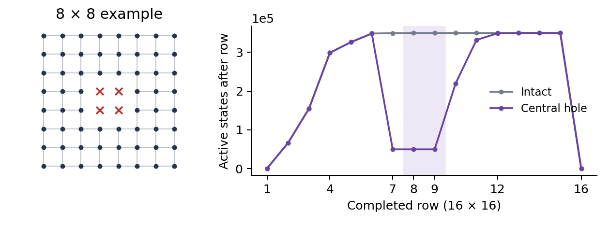

# Hamiltonian cycles on square grids with a central 2 x 2 hole

Jason Roell

[PDF](../output/pdf/punctured-grid-cycles.pdf) | [Canonical LaTeX source](latex/roell-punctured-grids.tex)

# Definition and exact sequence

Let $`G_n`$ have vertices $`(x,y)`$ with $`1\leq x,y\leq2n`$, except for
$`(n,n)`$, $`(n,n+1)`$, $`(n+1,n)`$, and $`(n+1,n+1)`$. Edges join
lattice neighbors. For $`n\geq2`$, the graph has $`4n^2-4`$ vertices and
$`8n^2-4n-12`$ edges. Let $`H_n`$ count its Hamiltonian cycles as
undirected edge sets, with neither a starting vertex nor a direction
distinguished. Rotated and reflected edge sets are initially distinct.
Set $`H_1=0`$, since $`G_1`$ is empty. The first nonempty case $`G_2`$
is a single $`12`$-cycle.

| $`n`$ | $`|V(G_n)|`$ | $`H_n`$ |
|---:|---:|---:|
| 1 | 0 | 0 |
| 2 | 12 | 1 |
| 3 | 32 | 14 |
| 4 | 60 | 164102 |
| 5 | 96 | 9684216390 |
| 6 | 140 | 27867828294632440 |
| 7 | 192 | 1167509412814480584454378 |
| 8 | 252 | 1517021583328338160591145724550850 |
| 9 | 320 | 35604867201983888335090959513825934093936960 |
| 10 | 396 | 22194400531163887940263507134424320689889325050239815212 |

Undirected Hamiltonian cycles on the centrally punctured grid.
<a id="tab:raw"></a>

The computation gives the complete table through $`n=10`$ shown in
Table <a href="#tab:raw" data-reference-type="ref"
data-reference="tab:raw">1</a>. In particular,
``` math
H_8=1517021583328338160591145724550850.
```
The number $`O_n`$ of geometric orbits under the eight symmetries of the
square is calculated in
Section <a href="#sec:burnside" data-reference-type="ref"
data-reference="sec:burnside">5</a>. The code and data are at

<div class="center">

<https://github.com/jroell/punctured-grid-cycles>.

</div>

The counting programs and complete data are fixed at commit
[`2d0d15b`](https://github.com/jroell/punctured-grid-cycles/tree/2d0d15baa21d21f9436bcf5736be4969a0ad818f).
The revised manuscript and its build instructions are in the same
repository.

Connectivity transfer methods are established techniques for Hamiltonian
grid enumeration. The present calculation adapts them to this central
puncture. The relation to earlier work is discussed in
Section <a href="#sec:reproducibility" data-reference-type="ref"
data-reference="sec:reproducibility">8</a>.

# Frontier recurrence and correctness

Process lattice positions in row-major order. A frontier separates
processed positions from unprocessed positions and has at most $`w+1`$
slots for a board of width $`w`$. Each slot is empty or carries a
selected edge to the unprocessed side. Every processed vertex has its
required degree, and every component built so far is a path. The state
records which occupied slots are the two ends of each path.

In the primary implementation, planarity makes the endpoint pairing
noncrossing. Empty slots are encoded by $`0`$, and the two ends of each
pair by opening and closing parentheses, represented by $`1`$ and $`2`$.
A word uses $`2(w+1)`$ bits. The checker stores each partner index
explicitly, without parenthesis matching. Both implementations aggregate
equal states in hash maps. Empty slots and noncrossing pairs form
Motzkin words, giving an upper bound of $`M_{w+1}`$ possible states. At
width $`16`$ this bound is $`M_{17}=2356779`$; at width $`20`$ it is
$`M_{21}=142547559`$. Only reachable states are created.

## Local transitions

At a remaining vertex, the numbers of selected incoming and outgoing
edges sum to two. There are five cases.

1.  With no incoming edge, select both outgoing edges, right and down,
    if both neighbors exist, and create a paired path.

2.  With one incoming edge, select one available outgoing edge and move
    the incoming path endpoint to it.

3.  With two incoming edges from different paths, select no outgoing
    edge, join the paths, and pair their other endpoints.

4.  With two incoming edges from the same path, accept only at the last
    remaining vertex, with no other occupied frontier slots.

5.  At a deleted position, permit no selected incident edges. Pass the
    state through only when both local slots are empty.

If $`D_t(s)`$ counts partial edge sets producing state $`s`$ after $`t`$
positions, then
``` math
D_{t+1}(s')=\sum_{s}\sum_{\substack{\text{legal local choices}\\s\longrightarrow s'}}D_t(s).
```
Initialize the empty state with weight one. At row boundaries, shift the
contour slots. At the final vertex, accumulate only a legal single-cycle
closure. Each local update has at most two choices; locating a matching
parenthesis can scan $`O(w)`$ slots.

## Correctness

Induct on the processing order. Every legal transition gives the newly
processed vertex degree two and preserves the path interpretation of the
frontier. Joining two ends of the same path is the only way to create a
closed component. Rejecting that transition before the final closure
therefore excludes every disconnected $`2`$-factor. Conversely,
restricting a Hamiltonian cycle to successive processed regions produces
exactly these legal states and choices. Every edge is decided once, at
its earlier endpoint. Thus every accepted edge set has one construction
history, and no division by the cycle length or by two is required.

The implementations use checked unsigned $`256`$-bit counters,
represented by four $`64`$-bit limbs. Addition aborts on overflow
instead of wrapping. No overflow occurred in the recorded runs. Accepted
dimensions are at most $`24`$, keeping both state encodings within their
supported widths. The verified main tables in this note cover
$`n\leq10`$.

# Hole handling, pruning, and state counts

A removed vertex contributes only an empty local transition. Edges
pointing into the hole are disabled before selection. The scan still
crosses the entire rectangular board. Empty slots at the hole do not
split the state into independent left and right problems: paths on
opposite sides may already be connected through the processed region.
Their pairing is retained globally.

The hole creates an inner face, but does not invalidate noncrossing
pairings on the outer scan contour. Disjoint planar paths with endpoints
on that contour cannot realize an interlacing pairing. No winding label
is needed for the raw count, because the pairing retains the
connectivity relevant to subsequent extensions.

<figure id="fig:states" data-latex-placement="htbp">

<figcaption>Deleted vertices in the
<math display="inline" xmlns="http://www.w3.org/1998/Math/MathML"><semantics><mrow><mn>8</mn><mo>×</mo><mn>8</mn></mrow><annotation encoding="application/x-tex">8\times8</annotation></semantics></math>
example, and row-end state counts at side
<math display="inline" xmlns="http://www.w3.org/1998/Math/MathML"><semantics><mn>16</mn><annotation encoding="application/x-tex">16</annotation></semantics></math>.
Shading marks the rows with deleted vertices. The reduction starts one
row earlier because edges into the hole are disabled. The maximum over
all vertex transitions exceeds the row-end maximum.</figcaption>
</figure>

| $`2n`$ |  Hole peak | Intact peak |    Seconds | RSS (MiB) |
|-------:|-----------:|------------:|-----------:|----------:|
|      4 |          1 |          11 |   0.000010 |     1.719 |
|      6 |         40 |          59 |   0.000040 |     1.750 |
|      8 |        339 |         341 |   0.000233 |     1.891 |
|     10 |      2,120 |       2,120 |   0.002916 |     2.578 |
|     12 |     13,943 |      13,943 |   0.035642 |     5.422 |
|     14 |     95,660 |      95,660 |   0.476549 |    24.375 |
|     16 |    677,909 |     677,909 |  11.006828 |   315.797 |
|     18 |  4,928,252 |   4,928,252 |  19.928776 |  1233.266 |
|     20 | 36,572,939 |  36,572,939 | 205.434662 |  9856.422 |

Primary-counter peak states for punctured and intact boards. Time and
memory refer to punctured boards. Sides through $`16`$ use standard hash
maps; larger sides use Boost flat maps, so timings are not directly
comparable. <a id="tab:metrics"></a>

The equal peaks from side $`10`$ onward occur after the hole rows in the
punctured scans. At sides $`10,12,14,16`$, exact comparisons at the
first punctured peak position find the same reachable frontier keys as
on the intact board at that position. This does not imply equal state
weights. Thus the hole’s restriction on reachable states has disappeared
by those peaks. These comparisons concern the state sets, not merely
their cardinalities; the analogous set equality at sides $`18`$ and
$`20`$ has not been tested.

At side $`16`$, the peak of 677,909 active states first occurs after row
$`13`$, column $`13`$. The row-end maximum is $`349998`$. The two hash
maps coexist during a transition; process RSS includes both maps, their
buckets, and allocator overhead. The recorded run took 11.01 seconds and
used 315.8 MiB peak RSS. Measurements are single observations on an
Apple M4 Max with $`128`$ GiB RAM, using Apple clang 21.0.0 with
`-O3 -std=c++17`. They are not repeated, isolated performance
benchmarks. The larger runs use Boost 1.92.0 flat hash maps for
aggregation. The explicit-partner counter also supports local updates to
partner fields rather than decoding and re-encoding the whole frontier
at every vertex. These changes preserve the state definition and
recurrence. All $`46`$ established raw and symmetry runs were rechecked
with the flat-map backend, including peak states. The punctured
side-$`18`$ count was also checked with both original standard-map
implementations. Some extension and validation runs overlapped on the
workstation; their timings are not isolated comparisons.

Pruning uses degree constraints, missing-neighbor constraints, and
rejection of premature cycles. The raw counter does not identify states
under rotations or reflections, and does not perform future-reachability
pruning. Symmetries are counted separately by the reductions below.

# Fixed cycles on smaller boards

Write $`R_2`$ for the number of full-board cycles fixed by $`180^\circ`$
rotation, $`R_4`$ for those fixed by $`90^\circ`$ rotation, $`F`$ for
those fixed by one specified axial reflection, and $`B`$ for those fixed
by both axial reflections. These counts depend on $`n`$, suppressed in
the notation. The symmetry counter uses explicit endpoint partners and
temporary boundary stubs, and never closes a path inside the smaller
board.

## Half board: $`F`$ and $`R_2`$

Take rows $`1`$ through $`n`$, with the two central vertices deleted
from the last row. A reflection-fixed spanning cycle must cross the
reflection axis. Every crossing edge is fixed setwise. The induced
order-two cycle automorphism is either a reflection or a half-shift. A
half-shift fixes no edge setwise, so the crossing rules it out. Thus the
automorphism is a reflection with no fixed vertices and exactly two
fixed edges. These are exactly the two crossings. The retained half is a
Hamiltonian path with both endpoints at allowed positions on the cut.
Counting final states with exactly two paired stubs gives $`F`$.

The half-turn has its center at a lattice face center and fixes no
vertex or edge setwise. It therefore acts freely on vertices and edges
of the cycle. Identify omitted vertices with their rotated
representatives. On the cut, pair column $`x`$ with column $`2n+1-x`$.
Selected seam edges complete the half-board paths into a quotient cycle.
Require one quotient component and an odd number of seam edges. Each
seam changes the copy index by one modulo two, so odd parity makes the
lift one cycle instead of two. This gives $`R_2`$ without constructing
full-board cycles.

## Quarter board: $`R_4`$ and $`B`$

For a quarter-turn, use the $`n\times n`$ quadrant with corner $`(n,n)`$
deleted. Add seam edges joining $`(n,k)`$ to $`(k,n)`$, for
$`1\leq k<n`$. A connected quotient cycle lifts to one cycle on four
copies precisely when its net change of copy index is coprime to four.
Each seam contributes $`+1`$ or $`-1`$. Thus the condition is equivalent
to an odd number of seam edges. Final states are tested for this parity
and a single quotient component. This is the punctured analogue of the
quadrant construction used by Wynn  for intact grids.

<figure id="fig:quarter" data-latex-placement="htbp">

<figcaption>Quarter-board quotient for side
<math display="inline" xmlns="http://www.w3.org/1998/Math/MathML"><semantics><mn>8</mn><annotation encoding="application/x-tex">8</annotation></semantics></math>.
Dashed curves are additional seam edges, not original grid edges. The
corner
<math display="inline" xmlns="http://www.w3.org/1998/Math/MathML"><semantics><mrow><mo stretchy="false" form="prefix">(</mo><mn>4</mn><mo>,</mo><mn>4</mn><mo stretchy="false" form="postfix">)</mo></mrow><annotation encoding="application/x-tex">(4,4)</annotation></semantics></math>
is deleted.</figcaption>
</figure>

If a full cycle is fixed by both axial reflections, it crosses each axis
exactly twice. Cutting at those four edges leaves one spanning path in
each quadrant. Its endpoints lie on the two inner sides. Counting
quarter-board states with exactly two paired stubs, one on each inner
side, gives $`B`$. Reflection reconstructs the full cycle uniquely.

# Parity, diagonal reflections, and Burnside’s lemma

<div id="prop:parity" class="proposition">

**Proposition 1**. *If $`n\geq3`$ is odd, then $`G_n`$ has no
Hamiltonian cycle fixed by a quarter-turn. Equivalently, $`R_4=0`$ for
odd $`n`$.*

</div>

<div class="proof">

*Proof.* Color $`(x,y)`$ by the parity of $`x+y`$. A quarter-turn sends
it to $`(2n+1-y,x)`$ and exchanges the colors. Suppose a Hamiltonian
cycle $`C`$ is fixed by this rotation. Its length is $`N=4n^2-4`$. The
induced automorphism of $`C`$ has order four, since $`C`$ spans the
graph and the quarter-turn acts faithfully on its vertices. Every
order-four automorphism of an undirected cycle is a cyclic shift by
$`N/4`$ or $`3N/4`$ positions. These are $`n^2-1`$ and $`3(n^2-1)`$
positions. If $`n`$ is odd, both shifts are even. Since colors alternate
around $`C`$, such a shift preserves color, contradicting the color
exchange of the quarter-turn. ◻

</div>

The empty case $`n=1`$ also has $`R_4=0`$ by convention. The deletion
reverses the corresponding parity obstruction for intact grids : there
the cycle length is $`4n^2`$, so the quarter-turn induces a shift by
$`n^2`$ or $`3n^2`$ positions. When $`n`$ is even these shifts preserve
color, whereas the geometric quarter-turn exchanges colors; hence the
intact quarter-turn fixed count is zero for even $`n`$.

<div class="samepage">

<div id="prop:diagonal" class="proposition">

**Proposition 2**. *For $`n\geq3`$, neither diagonal reflection fixes a
Hamiltonian cycle of $`G_n`$.*

</div>

<div class="proof">

*Proof.* Each diagonal reflection fixes $`2n-2\geq4`$ remaining
vertices. If it preserved a Hamiltonian cycle, its restriction would be
a nonidentity cycle automorphism with at least four fixed vertices. A
nonidentity cycle automorphism fixes at most two vertices, a
contradiction. ◻

</div>

</div>

Let $`O_n`$ count geometric orbits of Hamiltonian-cycle edge sets under
$`D_4`$. For $`n\geq3`$,
Proposition <a href="#prop:diagonal" data-reference-type="ref"
data-reference="prop:diagonal">2</a> and Burnside’s lemma give
``` math
\begin{equation}
\label{eq:burnside}
O_n=\frac{H_n+R_2+2R_4+2F}{8}.
\end{equation}
```
The two quarter-turns have the same fixed set, and the two axial
reflections are conjugate. For $`n=2`$, add the two diagonal-reflection
contributions of one before dividing by eight; the unique $`12`$-cycle
is fixed by all of $`D_4`$. Set $`O_1=0`$.

| $`n`$ | $`R_2`$ | $`R_4`$ | $`F`$ | $`B`$ |
|---:|---:|---:|---:|---:|
| 2 | 1 | 1 | 1 | 1 |
| 3 | 2 | 0 | 4 | 2 |
| 4 | 398 | 18 | 436 | 20 |
| 5 | 39598 | 0 | 58198 | 138 |
| 6 | 155368312 | 8650 | 96650662 | 6406 |
| 7 | 480564699890 | 0 | 308860488706 | 201338 |
| 8 | 34116385160498522 | 106253220 | 10202488985967222 | 41184930 |
| 9 | 2811552194264884895872 | 0 | 740001412241179546444 | 6067605252 |
| 10 | 3914442037913372967313267520 | 31064776598948 | 515530816787170934773269074 | 5594443405532 |

Fixed edge-set counts for the punctured grids. $`F`$ refers to one
specified axial reflection; $`B`$ requires both. <a id="tab:fixed"></a>

| $`n`$ |                                                 $`O_n`$ |
|------:|--------------------------------------------------------:|
|     1 |                                                       0 |
|     2 |                                                       1 |
|     3 |                                                       3 |
|     4 |                                                   20676 |
|     5 |                                              1210546548 |
|     6 |                                        3483478580414922 |
|     7 |                                145938676601947358766460 |
|     8 |                       189627697916042276889063633686282 |
|     9 |             4450608400247986041886906383605585167240715 |
|    10 | 2774300066395485992532938392421228045172137752081602347 |

Geometric orbits under all eight symmetries of the square. <a id="tab:orbits"></a>

In particular,
``` math
O_8=189627697916042276889063633686282.
```
These are geometric equivalence classes, not classes under arbitrary
abstract graph isomorphism. Every computed Burnside numerator is
divisible by eight. This is a consistency check; the separate small-case
edge-orbit search provides a different enumeration check.

# Exact stabilizer classes

For $`n\geq3`$, a cycle cannot have both quarter-turn and
axial-reflection symmetry, since these would generate a forbidden
diagonal reflection. The five possible exact stabilizers have the orbit
counts in Table <a href="#tab:classformulas" data-reference-type="ref"
data-reference="tab:classformulas">5</a>.

| Exact stabilizer        | Orbit size |      Number of orbits |
|:------------------------|:----------:|----------------------:|
| Identity only           |     8      | $`(H_n-R_2-2F+2B)/8`$ |
| One axial reflection    |     4      |           $`(F-B)/2`$ |
| Half-turn only          |     4      |     $`(R_2-R_4-B)/4`$ |
| Both axes and half-turn |     2      |               $`B/2`$ |
| Quarter-turn rotations  |     2      |             $`R_4/2`$ |

Exact stabilizer decomposition for $`n\geq3`$. <a id="tab:classformulas"></a>

To derive these formulas, first note that $`B`$ and $`R_4`$ count
disjoint sets with order-four stabilizers, each with two members per
orbit. Subtracting these sets from $`R_2`$ leaves the half-turn-only
edge sets in orbits of size four. Each one-reflection orbit has two
members fixed by the specified axis, which gives $`(F-B)/2`$.
Subtracting all nontrivial stabilizers from $`H_n`$ gives the
identity-only count. This bookkeeping follows the corresponding
intact-grid analysis of Wynn .

| Exact stabilizer            |                  Number of orbits |
|:----------------------------|----------------------------------:|
| Identity only               | 189627697916042263258722834310968 |
| One axial reflection        |                  5101244472391146 |
| $`180^\circ`$ rotation only |                  8529096253265093 |
| Both axial reflections      |                          20592465 |
| Quarter-turn rotations      |                          53126610 |
| Full $`D_4`$                |                                 0 |
| Total                       | 189627697916042276889063633686282 |

Exact symmetry classes for the $`16\times16`$ punctured grid.
<a id="tab:classes"></a>

The class counts are nonnegative integers at every computed size. Their
sum is $`O_n`$, and weighting them by the orbit sizes $`8,4,4,2,2`$
recovers $`H_n`$. For $`n=2`$, there is instead one orbit with full
$`D_4`$ stabilizer and orbit size one.

# Finite-size comparison with intact grids

Let $`C_n`$ count undirected Hamiltonian cycles on the intact
$`2n\times2n`$ grid, as in OEIS A003763 . Both full counters reproduce
its values for $`n\leq10`$; the OEIS b-file contains terms through
$`n=13`$. Define
``` math
Q_n=\frac{H_n}{C_n},\qquad
c_n=C_n^{1/(4n^2)},\qquad h_n=H_n^{1/(4n^2-4)}.
```
The same-footprint ratio $`Q_n`$ is not a probability of surviving
vertex deletion: deleting vertices from an intact Hamiltonian cycle
generally does not leave a Hamiltonian cycle. The per-vertex quantities
$`c_n`$ and $`h_n`$ are finite-size growth estimators. Both vertex count
and boundary corrections matter in interpreting them.

For context, Jacobsen  reports the numerical estimate
$`\mu=1.472801\pm0.00001`$ for the square-lattice Hamiltonian-walk
connective constant, attributing it to Jacobsen and Kondev; his own
circuit-and-walk analysis gives $`1.473\pm0.001`$ in Eq. (4.4). This is
a numerical benchmark, not an exact constant or a proven limit for the
punctured sequence considered here.

| $`n`$ | $`H_n/C_n`$ | $`\log Q_n`$ |     $`c_n`$ |     $`h_n`$ |
|------:|------------:|-------------:|------------:|------------:|
|     3 | 0.013059701 | -4.338224012 | 1.213869718 | 1.085966682 |
|     4 | 0.035377668 | -3.341674516 | 1.271048904 | 1.221570580 |
|     5 | 0.020725521 | -3.876389441 | 1.308264601 | 1.270637022 |
|     6 | 0.025894009 | -3.653743666 | 1.334201899 | 1.310584485 |
|     7 | 0.020801394 | -3.872735292 | 1.353235262 | 1.334597523 |
|     8 | 0.023026163 | -3.771124175 | 1.367762905 | 1.354161936 |
|     9 | 0.020534244 | -3.885661351 | 1.379198061 | 1.368038963 |
|    10 | 0.021749399 | -3.828169175 | 1.388423611 | 1.379631942 |

Finite-size ratios and per-vertex growth estimators. <a id="tab:growth"></a>

<figure id="fig:growth" data-latex-placement="htbp">

<figcaption>Exact-count comparisons. Lines connect computed values only;
no asymptotic curve is fitted.</figcaption>
</figure>

For $`n=5,7,9`$, the odd-subsequence values of $`\log Q_n`$ are
approximately $`-3.8764`$, $`-3.8727`$, and $`-3.8857`$: nearly flat on
the scale of the observed even-subsequence variation. For
$`n=4,6,8,10`$, the even values decrease through $`-3.3417`$,
$`-3.6537`$, $`-3.7711`$, and $`-3.8282`$, with successive drops of
$`0.3121`$, $`0.1174`$, and $`0.0570`$. These data are consistent with
both parities approaching a common value around $`-3.88`$ to $`-3.89`$,
with the even subsequence approaching from above. As a descriptive
extrapolation only, continuing the last ratio of successive even drops,
about $`0.486`$, gives a geometric-tail estimate near $`-3.882`$. Three
drops do not establish a geometric correction or a limiting value. The
hole deletes two vertices of each checkerboard color for every $`n`$, so
color imbalance alone cannot explain the parity split. At $`n=8`$, the
punctured count is about $`2.3026\%`$ of the intact count for the same
outer board.

The log ratio $`\log Q_n`$ measures the change in the logarithm of the
number of configurations caused by the defect. Its negative can be
viewed as a dimensionless defect free-energy cost. This observable
removes the common outer footprint without introducing different
per-vertex normalizations.
Figure <a href="#fig:growth" data-reference-type="ref"
data-reference="fig:growth">3</a> plots $`\log Q_n`$ separately by
parity. Multiplying $`Q_n`$ by the numerical benchmark $`\mu^4`$ would
compensate heuristically for four missing vertices; on the log scale
this only adds $`4\log\mu`$. It does not establish a limiting defect
cost.

There is also a physical reason to retain a power-law alternative.
Hamiltonian polygons are fully packed (compact) polymers, for which
critical scaling is described by the loop-model field theory of Jacobsen
and Kondev . Compact-polymer universality must be distinguished from
that of dense polymers with vacancies; their exponents need not agree.
In a critical system a defect can carry a scaling dimension, so an
algebraic contribution is plausible. If this hole produced
$`Q_n\sim A n^{-x}`$, then $`\log Q_n=\log A-x\log n+o(1)`$, which could
change slowly over the present range. The cited theory does not identify
this hole with a particular scaling operator or determine its exponent.
A constant limit, such a logarithmic term in $`\log Q_n`$, and
parity-dependent corrections therefore remain hypotheses to test with
larger boards. No gluing argument proving equality of the bulk
coefficients is supplied here.

# Reproducibility and related work

The public repository <https://github.com/jroell/punctured-grid-cycles>
contains the source code, recorded data, and manuscript build
instructions. The complete exact-count reference is commit
[`2d0d15b`](https://github.com/jroell/punctured-grid-cycles/tree/2d0d15baa21d21f9436bcf5736be4969a0ad818f).

## Verification

The parenthesis and direct-partner frontier counters agree on all intact
and punctured boards at every even side from $`2`$ through $`20`$. They
share the integer type and the row-by-row decomposition, so these are
separately encoded cross-checks, not wholly independent mathematical
methods. Direct path enumeration checks the complete cycle sets at
punctured sides $`4`$ and $`6`$, including all eight symmetry actions. A
different Python checker branches on whole edge orbits and independently
verifies $`R_2,R_4,F,B`$ through punctured side $`8`$. Additional runs
of that checker verify $`R_4`$ and $`B`$ at sides $`10`$ and $`12`$. In
the repository, $`F`$ and $`R_2`$ at $`n\geq5`$, and $`R_4`$ and $`B`$
at $`n\geq7`$, still rely on the quotient implementation and consistency
checks, not an independent second enumeration. The intact results agree
with OEIS A003763 .

From a repository checkout, run

    make all
    make benchmark
    make test
    make flat BOOST_CPPFLAGS=-I/opt/homebrew/include
    python3 scripts/verify_backends.py
    python3 scripts/verify_more_symmetry.py
    python3 scripts/extend.py --backend flat
    python3 scripts/extend_symmetry.py
    python3 scripts/verify_extension.py
    python3 scripts/verify_frontier_sets.py
    uv sync --group paper
    uv run --group paper python scripts/build_paper.py

The optional Boost include path shown is for Homebrew on Apple Silicon;
omit it when Boost headers are on the default compiler include path. The
counters need a C++17 compiler supporting `unsigned __int128` and Python
3.11 or later. The manuscript build additionally uses Tectonic and
Pandoc; the Python document dependencies are pinned in `uv.lock`. The
original full-board benchmark uses a $`300`$-second timeout per run. The
symmetry counter stops after $`1800`$ seconds or fifty million active
states. The original symmetry benchmark additionally has a
$`260`$-second subprocess timeout. Larger raw runs have a
$`1800`$-second timeout and a monitored $`48`$ GiB RSS ceiling; the RSS
monitor polls every two seconds. Each small edge-orbit check has a
$`60`$-second limit. All jobs run finite case lists. Counts are stored
as decimal strings in JSON to avoid floating-point rounding. Timings and
memory use may differ by platform.

## Prior work and scope

Wynn  counts symmetry classes for intact square grids and uses quadrant
quotients for quarter-turn symmetry. Jacobsen  enumerates circuits,
walks, and chains by transfer methods. Blanco and Zeilberger  give a
recent fixed-width generating-function implementation. The present note
applies these ideas to a specified central puncture and records a
reproducible table through side $`20`$.

OEIS searches for consecutive terms of both $`H_n`$ and $`O_n`$ returned
no match on September 26, 2026. These searches and the literature check
are not exhaustive and do not establish priority. No OEIS identifier or
preprint identifier is asserted before it has been assigned.

<div class="thebibliography">

9 OEIS Foundation Inc., *The On-Line Encyclopedia of Integer Sequences*,
entry [A003763](https://oeis.org/A003763), accessed September 26, 2026.
E. Wynn, Enumeration of nonisomorphic Hamiltonian cycles on square grid
graphs, preprint, 2014,
[arXiv:1402.0545](https://arxiv.org/abs/1402.0545). J. L. Jacobsen,
Exact enumeration of Hamiltonian circuits, walks, and chains in two and
three dimensions, *J. Phys. A: Math. Theor.* **40** (2007), 14667–14678.
[doi:10.1088/1751-8113/40/49/003](https://doi.org/10.1088/1751-8113/40/49/003).
J. L. Jacobsen and J. Kondev, Field theory of compact polymers on the
square lattice, *Nucl. Phys. B* **532** (1998), 635–688.
[doi:10.1016/S0550-3213(98)00571-9](https://doi.org/10.1016/S0550-3213(98)00571-9).
P. Blanco and D. Zeilberger, Counting (and randomly generating)
Hamiltonian cycles in rectangular grids, preprint, 2026,
[arXiv:2603.24315](https://arxiv.org/abs/2603.24315).

</div>
